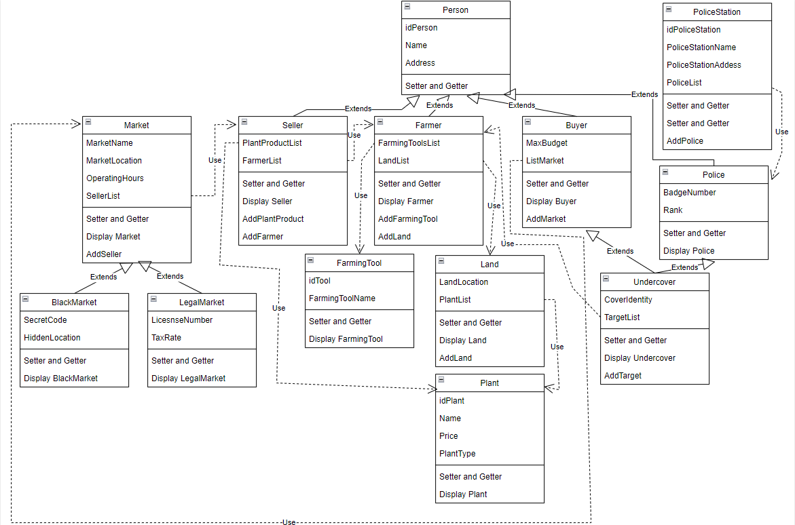

# TP3DPBO2425C1

NOTE : Tema ini saya ambil dengan persetujuan asprak yang bersangkutan.

# DIAGRAM

---

# PENJELASAN DIAGRAM CLASS

## 🔹 1. Inheritance

- **`Person`**
  - Atribut diwariskan: `idPerson`, `Name`, `Address`  
  - Diturunkan ke:  
    - `Police`  
    - `Buyer`  
    - `Farmer`  
    - `Seller`  

- **`Market`**
  - Atribut diwariskan: `marketName`, `marketLocation`, `operatingHours`, `sellerList`  
  - Diturunkan ke:  
    - `BlackMarket`  
    - `LegalMarket`  

- **`Police → Undercover`**
  - Atribut diwariskan: `BadgeNumber`, `Rank`  

- **`Buyer → Undercover`**
  - Atribut diwariskan: `MaxBudget`, `ListMarket`  

---

## 🔹 2. Composition

- **Farmer**
  - memiliki `List<Land>`  
  - memiliki `List<FarmingTool>`  
  - memiliki `List<Plant>`  

- **Seller**
  - memiliki `List<Plant>` (produk jualan)  
  - bermitra dengan `List<Farmer>`  

- **PoliceStation**
  - memiliki `List<Police>`  

- **BlackMarket**
  - memiliki `List<Seller>`  
  - memiliki `List<Buyer>`  
  - memiliki `List<Undercover>`  

- **Undercover**
  - memiliki `List<Farmer>` sebagai target operasi  

---

## 🔹 3. Array of Object

- **Market** → menyimpan banyak **Seller**  
- **Seller** → menyimpan banyak **Plant** dan **Farmer**  
- **Farmer** → menyimpan banyak **Land**, **Plant**, dan **FarmingTool**  
- **PoliceStation** → menyimpan banyak **Police**  
- **Undercover** → menyimpan banyak **Farmer** sebagai target 

## 🔹 4. Hierarchical Inheritance

- **Person** → diwariskan ke **Farmer**, **Seller**, **Buyer**, dan **Police**  
- **Market** → diwarisknn ke **BlackMarket** dan **LegalMarket**  

## 🔹 5. Multiple Inheritance

- **Undercover**  
  - mewarisi dari **Police**  
  - mewarisi dari **Buyer**  

## 🔹 6. Hybrid Inheritance

  - **Person** → diwarisi oleh **Police** dan **Buyer** (hierarchical)  
- **Undercover** → mewarisi dari **Police** dan **Buyer** (multiple)  
- Maka, terbentuk **Hybrid Inheritance**  

# PENJELASAN ATRIBUT DAN METHOD CLASS
###  1. **Class `Person`**  
    Atribut:    
      - idPerson (id unik setiap orang)  
      - Name (nama orang)  
      - Address (alamat tempat tinggal orang)  

    Method:  
      - Getter untuk semua atribut  
      - Setter untuk semua atribut kecuali id (agar id tidak bisa diubah setelah di construct)  

###  2. **Class `Farmer`**  
    Atribut:  
      - FarmingToolList (Alat yang digunakan petani)  
      - LandList (Lahan yang dimiliki oleh petani)  

    Method:  
      - Getter untuk semua atribut  
      - Setter untuk semua atribut  
      - AddFarmingTool untuk menambahkan farming tool  
      - AddLand untuk menambahkan lahan  
      - DisplayFarmer untuk menampilkan semua data `Farmer`  

###  3. **Class `Buyer`**  
    Atribut:  
      - MaxBudget (Jumlah maksimal uang yang bisa digunakan)  
      - ListMarket (List Pasar tempat buyer berbelanja)  

    Method:  
      - Getter untuk semua atribut  
      - Setter untuk semua atribut  
      - AddMarket untuk menambahkan pasar  
      - DisplayBuyer untuk menampilkan semua data `Buyer`  

 ### 4. **Class `Seller`**  
    Atribut:  
      - PlantProductList (List tanaman yang seller jual)  
      - FarmerList (Petani mitra tempat seller mendapatkan produk)  

    Method:  
      - Getter untuk semua atribut  
      - Setter untuk semua atribut  
      - AddPlantProduct untuk menambahkan produk tanaman  
      - AddFarmer untuk menambahkan petani  
      - DisplaySeller untuk menampilkan semua data `Seller`  

###  5. **Class `Police`**  
    Atribut:  
      - BadgeNumber (Nomor unik yang hanya dimiliki polisi)  
      - Rank (Posisi yang dimiliki oleh polisi)  

    Method:  
      - Getter untuk semua atribut  
      - Setter untuk semua atribut  
      - DisplayPolice untuk menampilkan semua data `Police`  

###  6. **Class `UnderCover`**  
    Atribut:  
      - CoverIdentity (Identitas rahasia yang digunakan intel)  
      - TargetList (List petani yang dijadikan suspect)  

    Method:  
      - Getter untuk semua atribut  
      - Setter untuk semua atribut  
      - AddTarget untuk menambahkan petani  
      - DisplayUndercover untuk menampilkan semua data `Undercover`  

###  7. **Class `PoliceStation`**  
    Atribut:  
      - idPoliceStation (id unik setiap kantor polisi)  
      - PoliceStationName (Nama dari kantor polisi)  
      - PoliceStationAddress (Alamat dari kantor polisi)  
      - PoliceList (List polisi yang ditugaskan di kantor polisi)  

    Method:  
      - Getter untuk semua atribut  
      - Setter untuk semua atribut kecuali id (agar tidak bisa diubah setelah di construct)  
      - AddPolice untuk menambahkan polisi  
      - DisplayPoliceStation untuk menampilkan semua data `PoliceStation`  

###  8. **Class `FarmingTool`**  
    Atribut:  
      - idTool (id unik setiap alat)  
      - FarmingToolName (nama dari alat)  

    Method:  
      - Getter untuk semua atribut  
      - Setter untuk semua atribut selain id (agar id tidak bisa diubah lagi setelah di construct)  
      - DisplayFarmingTool untuk menampilkan semua data `FarmingTool`  

###  9. **Class `Land`**  
    Atribut:  
      - LandLocation (lokasi dari lahan)  
      - PlantList (list dari tanaman yang ditanam)  

    Method:  
      - Getter untuk semua atribut  
      - Setter untuk semua atribut  
      - AddPlant untuk menambahkan tanaman  
      - DisplayLand untuk menampilkan semua data `Land`  

###  10. **Class `Plant`**  
    Atribut:  
      - idPlant (id unik untuk setiap tanaman)  
      - Name (nama tanaman)  
      - Price (harga tanaman)  
      - PlantType (jenis tanaman legal atau illegal)  

    Method:  
      - Getter untuk semua atribut  
      - Setter untuk semua atribut kecuali id (agar id tidak bisa diubah setelah construct)  
      - DisplayPlant untuk menampilkan semua data `Plant`  

###  11. **Class `Market`**  
    Atribut:  
      - MarketName (nama dari pasar)  
      - MarketLocation (Lokasi dari pasar)  
      - OperatinHours (jam buka pasar)  
      - SellerList (List pedagang yang berjualan di pasar)  

    Method:  
      - Getter untuk semua atribut  
      - Setter untuk semua atribut  
      - AddSeller untuk menambahkan pedagang  
      - DisplayMarket untuk menampilkan semua data `Market`  

###  12. **Class `LegalMarket`**  
    Atribut:  
      - LicenseNumber (Nomor bisnis yang terdaftar di pemerintah)  
      - TaxRate (Nilai pajak dari pasar)  

    Method:  
      - Setter untuk semua atribut  
      - Getter untuk semua atribut  
      - DisplayLegalMarket untuk menampilkan semua data `LegalMarket`  

###  13. **Class `BlackMarket`**  
    Atribut:  
      - SecretCode (Kode rahasia untuk masuk ke black market)  
      - HiddenLocation (Lokasi sebenarnya dari black market)  

    Method:  
      - Getter untuk semua atribut  
      - Setter untuk semua atribut  
      - DisplayBlackMarket untuk menampilkan semua data `BlackMarket`  

# ALUR PROGRAM

1. Program menambahkan data dummy ke Array of Object  
2. Program menambahkan data melalui method addFarmingTool, addPlant, addLand, addFarmer, addPlantProduct, addSeller, addMarket, addPolice, dan addTarget  
3. Program menampilkan informasi sebelum dan sesudah diupdate  

# DOKUMENTASI

## CPP
Sebelum Ditambah  

  

Setelah Ditambah  

  

## PYTHON
Sebelum Ditambah  

    

Setelah Ditambah  

  

## JAVA
Sebelum Ditambah  

  

Setelah Ditambah  

  